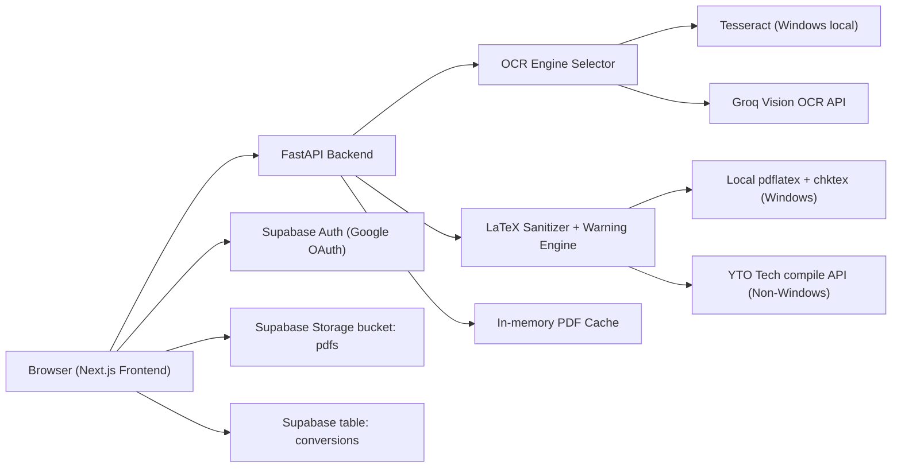

# LaTeX OCR - Technical Documentation

## 1. System Overview

LaTeX OCR is a full-stack application that converts images containing handwritten or printed LaTeX into compiled PDF output. The platform implements three major capabilities:

1. OCR extraction from uploaded images.
2. LaTeX compilation with syntax diagnostics and warning generation.
3. Optional persistence of conversion history per authenticated user via Supabase.

The codebase is split into:

1. A Python/FastAPI backend for OCR, validation, and PDF compilation.
2. A Next.js frontend for upload, editing, preview, and download.
3. Supabase Auth + Storage + Postgres tables for user identity and history.

## 2. High-Level Architecture



## 3. Repository Structure

Primary implementation paths are:

1. `backend/main.py` - production backend entrypoint.
2. `backend/requirements.txt` - backend Python dependencies.
3. `frontend/app/page.tsx` - primary UI workflow.
4. `frontend/app/components/Auth.tsx` - Google sign-in/out via Supabase.
5. `frontend/app/components/History.tsx` - conversion history list and restore.
6. `frontend/app/components/PdfViewer.tsx` - PDF rendering and navigation.
7. `frontend/lib/supabase.ts` - Supabase client initialization.
8. `render.yaml` - Render deployment definition for backend.
9. `build.sh` - Render build-time OS package installation.

Legacy or duplicate files also exist at repository root:

1. `main.py`
2. `page.tsx`
3. `PdfViewer.tsx`

These are not the files referenced by `render.yaml` for deployment and should be treated as secondary copies unless explicitly aligned.

## 4. End-to-End Runtime Flows

### 4.1 Image Upload Flow

1. User uploads image from file picker or camera capture in frontend.
2. Frontend sends `multipart/form-data` to `POST /upload`.
3. Backend validates MIME type and size.
4. Backend executes OCR path:
1. On Windows: attempts Tesseract first when confidence threshold is met.
2. Otherwise: calls Groq vision model.
5. Backend returns extracted LaTeX text and OCR metadata.
6. Frontend auto-triggers compilation using extracted text.

### 4.2 Compile Flow

1. Frontend sends JSON payload `{ "latex": "<code>" }` to `POST /compile`.
2. Backend performs security checks against restricted LaTeX primitives.
3. Backend performs warning generation:
1. Outdated package detection.
2. Common syntax anti-pattern detection.
4. Backend rewrites `\includegraphics` commands to placeholders.
5. Backend computes cache key from transformed LaTeX and checks in-memory cache.
6. If cache miss:
1. Windows: local `pdflatex` compilation and `chktex` warning scan.
2. Non-Windows: remote compile call to `https://latex.ytotech.com/builds/sync`.
7. Backend returns:
1. PDF bytes on success with warning metadata in headers.
2. JSON error payload on failure with parsed line-level diagnostics.
8. Frontend displays PDF in canvas viewer or error/warning diagnostics in LaTeX tab.

## 5. Backend Technical Design

### 5.1 Technology Stack

1. FastAPI for HTTP API.
2. Starlette CORS middleware.
3. Groq SDK for vision LLM OCR fallback.
4. pytesseract + PIL for local OCR path (Windows).
5. pdflatex and chktex (local compile/lint, Windows path).
6. httpx for external compile API calls on non-Windows.

### 5.2 API Surface

#### `GET /`

Purpose:
1. Liveness probe.

Response:
1. `{ "message": "Backend is alive!" }`

#### `POST /upload`

Request:
1. Multipart form field `file`.

Validation:
1. Allowed content types: `image/jpeg`, `image/png`, `image/jpg`, `image/webp`, `image/bmp`.
2. Max payload size: 10 MB.

Response (backend/main.py path):
1. `filename` - original uploaded name.
2. `text` - extracted LaTeX candidate.
3. `engine` - `"tesseract"` or `"groq"`.
4. `confidence` - numeric confidence (Tesseract path) or `0` (Groq path).

#### `POST /compile`

Request body:

```json
{
  "latex": "\\documentclass{article}\\begin{document}x\\end{document}"
}
```

Success:
1. Binary PDF body.
2. `Content-Type: application/pdf`.
3. Warning headers:
1. `X-Warnings-Count`.
2. `X-Warnings-Data` (base64-encoded JSON array).
3. Optional `X-Cache: HIT` when served from cache.

Failure:
1. JSON payload with fields such as:
1. `error`
2. `error_lines`
3. `warning_lines`
4. `stdout`
5. `stderr`

Note:
1. Current implementation returns JSON errors without explicit HTTP status differentiation (commonly HTTP 200). Clients must inspect payload/content type.

### 5.3 OCR Strategy

Function `auto_ocr(image_bytes)` implements runtime selection:

1. If host OS is Windows:
1. Compute Tesseract confidence using `image_to_data`.
2. If average confidence >= 60, extract text via Tesseract.
2. Else or non-Windows:
1. Send base64 image to Groq chat completion API (`meta-llama/llama-4-scout-17b-16e-instruct`).
2. Prompt requests raw LaTeX output with no markdown.

### 5.4 Compile and Analysis Pipeline

#### Security Sanitization

`sanitize_latex` blocks regex-matched patterns:

1. `\write18`
2. `\catcode`
3. `\openout`
4. `\openin`
5. `\immediate`
6. `\include{...}`
7. `\input{...}`

This is intended to limit file I/O and shell escape attack vectors.

#### Warning Generation

Warnings are generated by:

1. `check_outdated_packages`:
1. Maps deprecated package names to modern alternatives.
2. Flags suspicious `\includegraphics` bracket syntax.
3. Flags `$$` display math usage.
4. Flags missing `\documentclass`.
2. `check_latex_warnings` on Windows:
1. Runs `chktex -q -wall`.

#### Image Placeholder Rewriting

`replace_images_with_placeholders` does two transforms:

1. Injects `\usepackage{graphicx}` after `\documentclass` if missing.
2. Rewrites `\includegraphics[...] {file}` to framed placeholder boxes preserving width when present.

This avoids compile failures when referenced image files are unavailable.

#### Platform-Specific Compilation

Windows:

1. Writes temporary `document.tex`.
2. Runs `pdflatex -interaction=nonstopmode --no-shell-escape`.
3. Parses pdflatex output for `!` lines and subsequent `l.<line>` references.
4. Collects chktex warnings concurrently via `ThreadPoolExecutor`.
5. Returns generated PDF if present.

Non-Windows:

1. Sends compile request to YTO Tech synchronous build API.
2. On error, attempts to parse LaTeX logs from returned JSON.
3. On success, streams returned PDF bytes.

### 5.5 Caching

1. In-memory dictionary `pdf_cache` keyed by `md5(latex_code_after_transform)`.
2. Value tuple: `(pdf_bytes, warnings)`.
3. Maximum entries: 50.
4. Eviction: remove oldest inserted key when limit is reached.
5. Scope: process-local, non-persistent, reset on restart/deploy.

## 6. Frontend Technical Design

### 6.1 Technology Stack

1. Next.js 16 App Router.
2. React 19.
3. TypeScript.
4. Tailwind CSS v4.
5. `pdfjs-dist` for PDF rendering on canvas.
6. Supabase JS client v2.
7. Lucide icon library.

### 6.2 UI State Model (`frontend/app/page.tsx`)

Core state variables include:

1. `extractedText` - editable LaTeX source.
2. `isUploading` - upload/OCR operation state.
3. `isCompiling` - compile operation state.
4. `engine` - OCR engine label from backend.
5. `compileError` - structured error list.
6. `compileWarnings` - structured warning list.
7. `pdfUrl` - object URL for compiled PDF blob.
8. `activeTab` - `"preview"` or `"latex"`.
9. `user` - Supabase authenticated user.

### 6.3 Component Responsibilities

`Auth.tsx`:

1. Triggers Supabase OAuth with Google.
2. Uses `NEXT_PUBLIC_SITE_URL` as callback fallback.
3. Supports sign-out and displays profile metadata.

`History.tsx`:

1. Fetches latest 20 rows from `conversions`.
2. Supports restore (copy stored LaTeX back to editor).
3. Supports row deletion.

`PdfViewer.tsx`:

1. Loads PDF with `pdfjs-dist`.
2. Renders current page into `<canvas>`.
3. Supports paging, zoom in/out, reset zoom.
4. Supports two-finger pinch zoom on touch devices.

### 6.4 API Consumption Model

`uploadImage(...)`:

1. Sends file to `${NEXT_PUBLIC_BACKEND_URL}/upload`.
2. Writes returned text into editor.
3. Immediately calls compile pipeline.

`compile(...)`:

1. Sends JSON to `${NEXT_PUBLIC_BACKEND_URL}/compile`.
2. Treats JSON response as compile failure payload.
3. Decodes `X-Warnings-Data` using `atob`.
4. Renders PDF preview if binary response is valid.

## 7. Supabase Integration

### 7.1 Auth

1. Supabase Auth session is loaded on mount and subscribed for changes.
2. Google OAuth provider is used from frontend.

### 7.2 Storage

1. Bucket: `pdfs`.
2. Upload path convention: `${user.id}/${Date.now()}.pdf`.
3. App reads public URL via `getPublicUrl`.

### 7.3 Database

Table expected by frontend: `conversions`.

Fields used by code:

1. `id`
2. `user_id`
3. `latex_code`
4. `pdf_url`
5. `created_at`

Recommended minimal SQL:

```sql
create table if not exists public.conversions (
  id uuid primary key default gen_random_uuid(),
  user_id uuid not null references auth.users(id) on delete cascade,
  latex_code text not null,
  pdf_url text,
  created_at timestamptz not null default now()
);
```

Recommended row-level security controls:

```sql
alter table public.conversions enable row level security;

create policy "select own conversions"
on public.conversions
for select
using (auth.uid() = user_id);

create policy "insert own conversions"
on public.conversions
for insert
with check (auth.uid() = user_id);

create policy "delete own conversions"
on public.conversions
for delete
using (auth.uid() = user_id);
```

Important:
1. `History.tsx` currently queries without explicit `where user_id = ...`; secure access therefore depends on RLS.

## 8. Environment Variables

### 8.1 Backend

Required:

1. `GROQ_API_KEY` - used by Groq OCR fallback.

Optional platform behavior:

1. On Windows, Tesseract executable path is hardcoded to `C:\Program Files\Tesseract-OCR\tesseract.exe`.

### 8.2 Frontend (`frontend/.env.local`)

Required:

1. `NEXT_PUBLIC_BACKEND_URL` - backend API base URL.
2. `NEXT_PUBLIC_SUPABASE_URL` - Supabase project URL.
3. `NEXT_PUBLIC_SUPABASE_ANON_KEY` - Supabase anon key.

Optional:

1. `NEXT_PUBLIC_SITE_URL` - OAuth redirect target for Supabase sign-in.

## 9. Local Development Setup

## 9.1 Backend Setup

Linux/macOS:

```bash
cd backend
python -m venv .venv
source .venv/bin/activate
pip install -r requirements.txt
uvicorn main:app --reload --host 0.0.0.0 --port 8000
```

Windows (PowerShell):

```powershell
cd backend
python -m venv .venv
.venv\Scripts\Activate.ps1
pip install -r requirements.txt
uvicorn main:app --reload --host 0.0.0.0 --port 8000
```

Windows prerequisites for local compile path:

1. Install Tesseract OCR.
2. Install a TeX distribution that provides `pdflatex`.
3. Install `chktex` and ensure it is on PATH.

Linux package equivalent used in deployment:

1. `tesseract-ocr`
2. `texlive-latex-base`
3. `texlive-fonts-recommended`
4. `texlive-latex-extra`
5. `chktex`

### 9.2 Frontend Setup

```bash
cd frontend
npm install
npm run dev
```

Frontend default dev URL: `http://localhost:3000`.

## 10. Deployment Model

### 10.1 Backend (Render)

`render.yaml` defines:

1. Runtime: Python web service.
2. Build command: `bash build.sh`.
3. Start command: `cd backend && uvicorn main:app --host 0.0.0.0 --port $PORT`.
4. Secret env var: `GROQ_API_KEY`.

`build.sh` installs OS-level compile and OCR tools and then Python dependencies.

### 10.2 Frontend

Frontend is not declared in `render.yaml`. Typical deployment options:

1. Vercel for Next.js frontend.
2. Any Node host that supports Next.js standalone or `next start`.

## 11. Operational Semantics and Headers

`POST /compile` success response headers:

1. `Content-Disposition: attachment; filename=output.pdf`
2. `X-Warnings-Count: <int>`
3. `X-Warnings-Data: <base64-json-array>`
4. `Access-Control-Expose-Headers: X-Warnings-Count, X-Warnings-Data`
5. `X-Cache: HIT` when cache hit occurs

Decoded warning object schema:

```json
{
  "message": "string",
  "line": "string or null",
  "context": "string"
}
```

## 12. Security Model and Risks

Current controls:

1. Regex-based filtering for selected dangerous LaTeX commands.
2. `--no-shell-escape` in local pdflatex invocation.
3. Allowed MIME and max-size validation on upload.
4. Browser CORS compatibility headers.

Current risk areas:

1. CORS is globally open (`allow_origins=["*"]`).
2. Backend endpoints are unauthenticated and publicly callable.
3. Regex sanitization is not a full parser and can miss edge cases.
4. Error responses often do not use precise HTTP status codes.
5. No backend rate limiter, although frontend has UI text for rate-limit handling.
6. In-memory cache has no TTL and no multi-instance coherence.

## 13. Performance Characteristics

1. OCR latency depends on local OCR confidence path versus remote Groq API latency.
2. Compile latency depends on local pdflatex performance or remote YTO API response time.
3. Cache hit returns compiled PDF immediately from memory.
4. Frontend PDF rendering cost scales with page complexity and selected zoom.

## 14. Known Inconsistencies and Gaps

1. Root-level `main.py`, `page.tsx`, and `PdfViewer.tsx` duplicate functionality in `backend/` and `frontend/`.
2. Frontend contains rate-limit error branch (`error === "rate_limited"`), but backend does not currently emit this contract.
3. Metadata in `frontend/app/layout.tsx` remains default ("Create Next App").
4. `next.config.ts` includes `allowedDevOrigins: ["*"]`, which is permissive for development.

## 15. Suggested Hardening and Improvement Backlog

1. Enforce authenticated access on backend compile/upload endpoints.
2. Add server-side rate limiting and return stable error contract with non-200 statuses.
3. Replace regex-only sanitizer with parser-based LaTeX policy enforcement.
4. Move cache to Redis for TTL and multi-instance support.
5. Consolidate duplicate root and nested source files.
6. Add unit tests for warning parser, sanitizer, and error extraction.
7. Add integration tests for `/upload` and `/compile` contract validation.
8. Add explicit user filtering in history query in addition to RLS.

## 16. Quick Verification Checklist

1. Upload valid image under 10 MB and confirm extracted LaTeX is populated.
2. Confirm `/compile` returns PDF with warning headers for valid LaTeX.
3. Confirm invalid LaTeX yields JSON with `error_lines`.
4. Confirm history restore/delete works for authenticated user.
5. Confirm warnings appear for deprecated package declarations.
6. Confirm cache hit returns `X-Cache: HIT` on repeated same input.